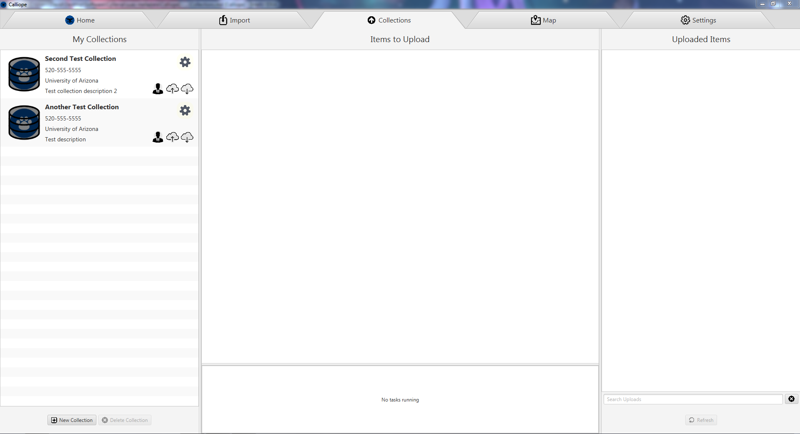

#Collections Tab

The collections tab is where you create and manage collections of images, as well as upload imported/tagged images. A collection is defined as a repository of images which may be shared with other users for analysis/callaboration. If you would like to start your own project see [Creating a Collection](#creating-a-collection), and if you would like to upload your images to someone else's project see [Uploading to a Collection](#uploading-to-a-collection). If you want to see what images have been uploaded to a collection, click it and uploads are displayed on the right panel.

##Creating a Collection
To create a collection select the 'New Collection' button on the bottom of the left panel. A new collection will appear on the left list named 'Untitled'. To setup this collection, select the gear icon in the top right corner. Here you can set the following properties:
- Name - The name of the collection.
- Organization - The organization running the collection, it is recommended to be set to 'None' or 'Nothing' for personal projects.
- Contact Info - An email or phone number which may be used to request access to a collection's images. (May be something other than email or phone number such as slack username if desired)
- Description - A brief description which should contain any information such as project goal to distinguish this collection from the rest.
- Permissions - A table of users that have access to this collection's images. By default it will contain your username with all permissions granted. The 'Add User' and 'Remove User' buttons let you can grant or revoke access of various users. Each permission does the following:
    - Read - A user with only read can see images uploaded but cannot upload anything.
    - Upload - Automatically grants read, but also allows users to upload any images to the image collection.
    - Administrator - A currently non-editable property that will be set to the creator of the collection. This user can edit a collection's properties like name and organization as well as permissions.

##Uploading to a Collection
To upload to a collection you must first have access to a collection. Either make a collection yourself (See: [Creating a Collection](#creating-a-collection)), or request access to an existing collection from the collection administrator. You can see what permissions you currently have at the bottom right of a collection. The cloud with an arrow pointing down indicates you may see images uploaded to a collection. The cloud with an arrow pointing up indicates you may upload to a collection, and the profile icon indicates you own a collection.

To upload images then, ensure you have upload permission to a collection and images from any data source have been imported. (See: [Import Tab](./Import.md)) The images should show up in the center pane of the collections tab. Drag and drop any directory from the center pane onto a collection on the left to upload to that collection. You will then be ask to confirm your upload. 

Depending on the data source, uploading images may perform different tasks and take different amounts of time. If data was imported from your local PC, the image files will be bundled in a TAR file and uploaded into a folder on the CyVerse datastore. This process will take some time depending on the number of images uploaded. If the data was imported from the CyVerse datastore, the upload will not transfer any images and instead simply notify the database of their presence. 