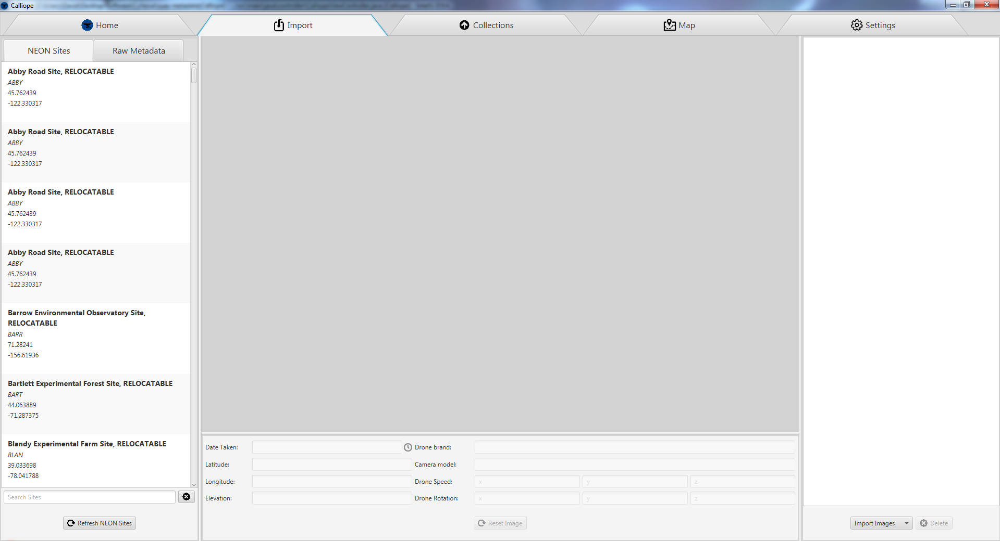

# Import Tab

The import tab is where you can begin importing your drone data for processing. To begin, click the 'Import Images' button found in the bottom right corner. You will be prompted to pick a data source to import images from. There are currently 3 different options:
1. CyVerse Data Store - If you have already uploaded your image data to the CyVerse Data Store you can use this option to import those files. This can happen if you use a third party tool to upload images such as CyberDuck or upload images straight to the Data Store using the Discovery Environment. 
2. Local PC File(s) - This option lets you pick specific image files on your local PC to import. You may import a single image or multiple images if you desire. If you import multiple images, they must all be found in the same directory. 
3. Local PC Directory - This option lets you pick a specific directory on your local PC to import. The directory will be recursively searched for any image files while ignoring unknown files. 

Supported file extensions are:
- jpg
- jpeg
- tiff
- tif
- psd
- png
- bmp
- gif
- ico

After importing images into Calliope you may view them by clicking on them on the right panel. Depending on the speed of the PC, storage medium, and file size the preview may take some time to load. A loading circle will appear in the top left of the central image preview window indicating an image is loading. Left and right arrows are found on the left and right side of the central window allowing you to navigate to the next and previous image respectively. You can scroll to zoom in and out of the image, and reset the zoom by double clicking the image or clicking 'Reset Image' at the bottom.

Once an image is selected, the bottom metadata panel becomes populated. Here you may update any incorrect metadata about a specific image file. If the image file is missing a piece of metadata, the field will be blank, or 0. The metadata fields are described below:
- Date Taken - The day and time the image was taken. This may be incorrect if the camera was setup improperly, and can be adjusted by either typing into the 'Date Taken' box or selecting the clock and picking a time. The value must be a valid date formatted in the same way as initially shown.
- Latitude - The exact latitude coordinate the drone was at the second the image was taken.  The value must be a valid number.
- Longitude - The exact longitude coordinate the drone was at the second the image was taken.  The value must be a valid number.
- Elevation - The elevation the drone was at the second the image was taken. This must be a valid number.
- Drone Brand - The brand of the drone, may be something like 'DJI'. This will be blank if the drone did not embed brand information on the image file. The brand name can contain any characters.
- Camera Model - The camera model used to take the image, may be something like 'FC330'. This will be blank if the drone did not embed camera information on the image file. The camera model name can contain any characters.
- Drone Speed - A 3-dimensional vector representing this drone's x, y, and z velocities the moment the image was taken. These will all be 0 if the drone did not embed any speed information on the image. All three fields must contain valid numbers.
- Drone Rotation - A 3-dimensional vector representing this drone's roll, pitch, and yaw the moment the image was taken. These will all be 0 if the drone did not embed any rotational information on the image. All three fields must contain valid numbers.

The left panel of the import window has two tabs, one for sites and one for Raw Metadata. 

The sites panel shows one entry per NEON or LTAR site. Some site names and codes may be repeated if two sites are nearby without a common geo-graphical boundary. To avoid confusion, Calliope adds a `-<Number>` to the end of each site name/code when the name/code is shared. For example, if two sites are called `Example Site Name` the first will be renamed to `Example Site Name-1` and the second will be renamed to `Example Site Name-2`. You can search for a site by typing into the 'Search Sites' box below the list of sites. The 'X' button will clear the current search. 

The Raw Metadata tab will show you all the raw metadata that was extracted from the image file. It is not editable, but can be useful for seeing what other data your images have stored. 

If you would like to specify that an imported image was taken at a specific site you can do one of two things:
1. To manually specify which site an image was taken at, drag a site from the left panel onto the central image preview or onto the image on the right panel to tag it with the site. You may also drag it to a directory, indicating that all images in that directory were taken at the given site. 
2. To automatically detect which site an image was taken at, select an image or directory, and then click on the globe icon in the top right corner of the central image preview window. You can then pick either:
    - Detect if the image was taken within <input> km of the center point of a site. The closest site is picked.
    - Detect if image was taken inside of a site based on the site's polygonal boundary. If the latitude and longitude the image was taken at is inside of boundary, the site is picked.