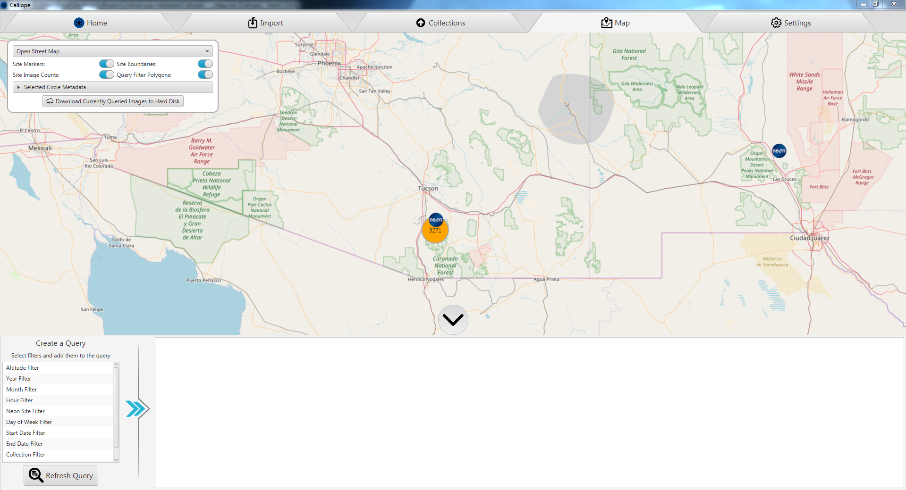

#Map Tab

The map tab allows you to analyze, query, visualize, and download any uploaded images on a map. 

## Map Visualization
To move the map, hold left click and drag. To zoom the map, scroll your mouse. 

The map shows the list of NEON site markers on the map. Clicking one of these markers shows site specifics. After zooming in enough, the site marker will become a 2D polygon that shows the exact site boundary. 

The map will also show the number of images in a specific region using orange circles which split or merge as you zoom in or out respectively. The images shown on the map respect the current query, so updating the query will update what images are shown. To do this, see [Map Query](#map-query). 

## Map Settings
Some settings are provided to reduce clutter or increase map usability. These are found in the top left corner of the map. Each of the following options is described below:
- 'Open Street Map' - The drop down box at the top allows you to select a different map provider if you so desire. By default Open Street Map is used, but other map providers such as 'Esri World Imagery' can give you satellite data.
- Site Markers - Disables or enables the 'NEON' icons on the map
- Site Boundaries - Disables or enables the NEON site boundaries that become visible when zoomed enough.
- Site Image Counts - Disables or enables the orange circles containing image counts.
- Query Filter Polygons - Disables or enables the polygons rendered by the 'Map Polygon Filter'. 
- Selected Circle Metadata - A table of images that is updated whenever an orange circle of images is selected. This table's size is limited by the 'Maximum Selection Results' value. Increase this value to retrieve more image results at the cost of query speed. 
- Download Currently Queried Images to Hard Disk - Downloads the current images provided by the map query to the local hard disk. A folder must be selected to download into. This process may take some time if many images are selected. 

## Map Query
To begin filtering what data is displayed on the map, select the circle at the bottom of the screen to expand the filter menu. Here you can add any number of filters which will filter all images in all collections you currently have access to. To add a filter, simply double click a filter in the left-most list. To remove a filter, select the 'X' in the top right corner of a filter. To temporarily disable a filter, de-select the enabled slider in the top left of a filter. Once satisfied with your query, select 'Refresh Query' to update what images are shown. Each filter is described below:
- Altitude Filter - Selects images based on their altitude metadata tag
- Year Filter - Selects a specific year or range of years that the image must be taken in
- Month Filter - Selects a set of months that the image must be taken in
- Hour Filter - Selects a set of hours that the image must be taken at
- Neon Site Filter - Selects any images that were tagged with the selected NEON sites
- Day of Week Filter - Selects images by the day of week they were taken
- Start Date Filter - Sets a minimum date for all images, any images taken before this date are ignored
- End Date Filter - Sets a maximum date for all images, any images taken after this date are ignored
- Collection Filter - Filters images by the collection they were uploaded to
- Map Polygon Filter - Filters images based on a polygon that can be drawn onto the map. To do this, follow the steps:
    1. Add a polygon filter to the query
    2. Add points to the polygon filter (must be at least 3 points)
    3. Drag and drop the location pin markers onto the map to set the points of the polygon. Once all pins are dropped the boundary polygon is drawn on the map in red.
