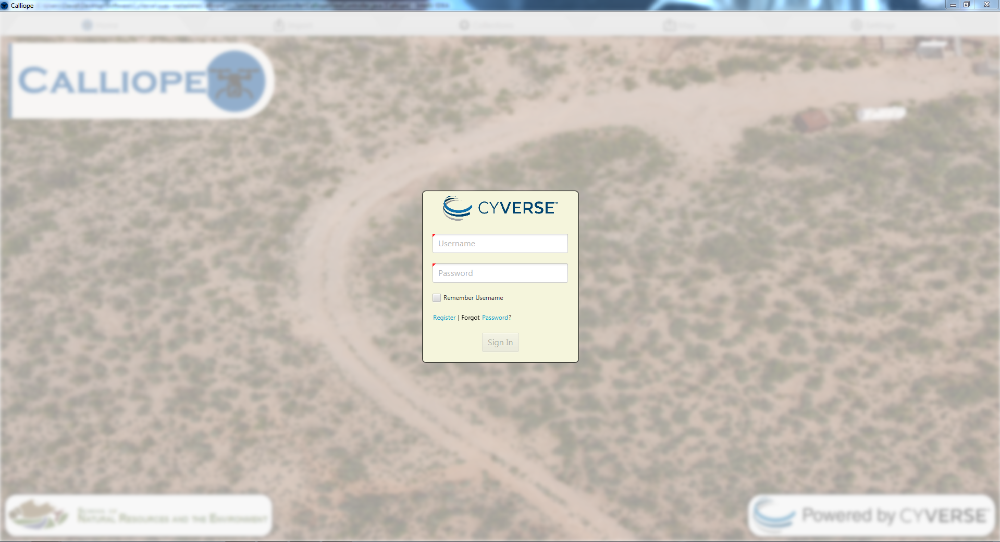

# Calliope User Manual

Calliope is a program developed by [CyVerse](https://www.cyverse.org/) for the University of Arizona [School of Natural Resources and the Environment](https://snre.arizona.edu/) and [Agricultural Research Service Southwest Watershed Research Center](https://www.ars.usda.gov/pacific-west-area/tucson-az/southwest-watershed-research-center/). Calliope allows users to tag drone metadata, transfer it onto a database for safe keeping, and then query using a map based interface.

## Installation

There are two different ways to run Calliope, either by building it from source using the contenst of this Git repo, or running a pre-built `jar` file, located in the `/Calliope/prebuild` directory.

Running a pre-built `jar` file is the easiest option, but building from source allows for additional customization and tweaking. 

Both options are described below.

#### Dependencies

To run Calliope there are two prerequisite dependencies that you will need to install first on your laptop or desktop.

**[Java 8/9/10](http://www.oracle.com/technetwork/java/javase/downloads/)**

Note: If you are using OpenJDK instead of Oracle's JDK, you will also need OpenJFX.

**[ExifTool](https://www.sno.phy.queensu.ca/~phil/exiftool/)**

ExifTool must be accessible in your system $PATH environment variable. Calliope will run without ExifTool so you can check if you have successfully installed ExifTool by launching Calliope and going to the settings tab. If the text at the bottom reads `ExifTool Installation Status: Found` you are good to go. If the text at the bottom reads `ExifTool Installation Status: Not Found` follow the instructions at the bottom of the settings tab to install ExifTool on your system. If you attempt to import images without having ExifTool installed you will be prompted to install ExifTool first.

### Running a Pre-Built `jar`

Download the [Calliope for Java 8](./prebuilt/Calliope-1.0-SNAPSHOT-Java-8.jar) or [Calliope for Java 9/10](./prebuilt/Calliope-1.0-SNAPSHOT-Java-9-10.jar). It is highly recommended to use the Java 8 version if possible. 

Run the Calliope by double clicking on the file or using the command: `java -jar Calliope-XX-SNAPSHOT-Java-XX.jar`

### Build from Source

This repository should be cloned and then built using maven. All Java dependencies will be automatically fetched through maven. Please note that you will need ExifTool installed on your system as well to import images and read metadata.  

#### Dependencies

**Java 8**

Note: If you are using OpenJDK instead of Oracle's JDK, you will also need OpenJFX.

**ExifTool**

**[Maven]()https://maven.apache.org/install.html)**

To use Java 9 or 10, you will need to edit the [pom.xml](./pom.xml) file. Find the line `<artifactId>controlsfx</artifactId>` and replace the next line with the right version of ControlsFX.

```xml
<version>8.40.14</version> <!-- Use this for Java 8 -->
<version>9.0.0</version> <!-- Use this for Java 9 or 10 -->
```

ExifTool must be accessible in your system $PATH environment variable. You can check if you have successfully installed ExifTool by launching Calliope and going to the settings tab. If the text at the bottom reads `ExifTool Installation Status: Found` you are good to go. If the text at the bottom reads `ExifTool Installation Status: Not Found` follow the instructions at the bottom of the settings tab to install ExifTool on your system. If you attempt to import images without having ExifTool installed you will be prompted to install ExifTool first.

#### Installation Commands

After installing all pre-requisites, clone the github repository into a directory:
```shell
git clone https://github.com/cyverse-gis/suas-metadata <directory>
```
Build the project into an executable JAR file to run:
```shell
cd '<directory>/Calliope/'
mvn -U compile package
```
Run the program:
```shell
java -jar '<directory>/Calliope/target/Calliope-1.0-SNAPSHOT-jar-with-dependencies.jar'
```

## Usage and Documentation

### First Time Calliope Execution

When first running Calliope you will most likely see a warning popup that says, `Invalid ElasticSearch host or port, please check 'calliope.properties'!`. A `calliope.properties` file will appear next to the `Calliope-*.jar` file that was executed. This file will need to be edited to be so that Calliope knows what ElasticSearch cluster to talk to. You will need to ask the project administrator for the ElasticSearch host IP and port number. If you are a system administrator you can also setup your own ElasticSearch index and use that if you desire.

### Logging In
The CyVerse infrastructure is heavily used by Calliope to both store data and authenticate users. In order to use Calliope, you will need a CyVerse account. Please make a free account here: https://user.cyverse.org/register. After registering you can open Calliope where you should be prompted with a login screen.



At this point you can enter your CyVerse account username and password into the respective fields. If you would like Calliope to remember your username in the future you can check the box. If you have not yet registered for an account click on the blue 'Register' text. If you have trouble logging in and would like to change your password click on 'Forgot Password'. 

### Calliope Interface Overview

Calliope's interface is broken up by tabs found on the top of the window. A short description of each tab is described below:
- [Home](./Home.md) - This tab allows you to exit the program and read credits.
- [Import](./Import.md) - This tab lets you import image data and modify any metadata that may be found on those images.
- [Collections](./Collections.md) - This tab lets you manage uploading data to and from your PC as well as showing what data has already been uploaded.
- [Map](./Map.md) - This tab allows you to see all uploaded images on an interactive map as well as perform queries to filter what data you see.
- [Settings](./Settings.md) - This tab lets you specify various settings, such as date and time format.

Hint: Click on a tab above to get a detailed description of the tab.

### Developer's Documentation

If you would like to work on this project an outline of the code structure can be found [here](./DeveloperDocumentation.md).

### Credits

This program is currently being developed by [CyVerse](https://www.cyverse.org/). It is heavily based on previous code from [Sanimal](https://github.com/DavidM1A2/Sanimal). 

- Software Developer - [David Slovikosky](https://github.com/DavidM1A2/)
- Project Supervisor - [Tyson Swetnam](https://github.com/tyson-swetnam)
- Funding Sources: University of Arizona School of Natural Resources and the Environment ([SNRE](https://snre.arizona.edu/)), & [USDA Agricultural Research Service Southwest Watershed Research Center](https://www.ars.usda.gov/pacific-west-area/tucson-az/southwest-watershed-research-center/)

**This material is based upon work supported by the U.S. Department of Agriculture, Agricultural Research Service, under Agreement no. 58-2022-5-13.**

**Any opinions, findings, conclusion, or recommendations expressed in this publication are those of the author(s) and do not necessarily reflect the view of the U.S. Department of Agriculture.**
