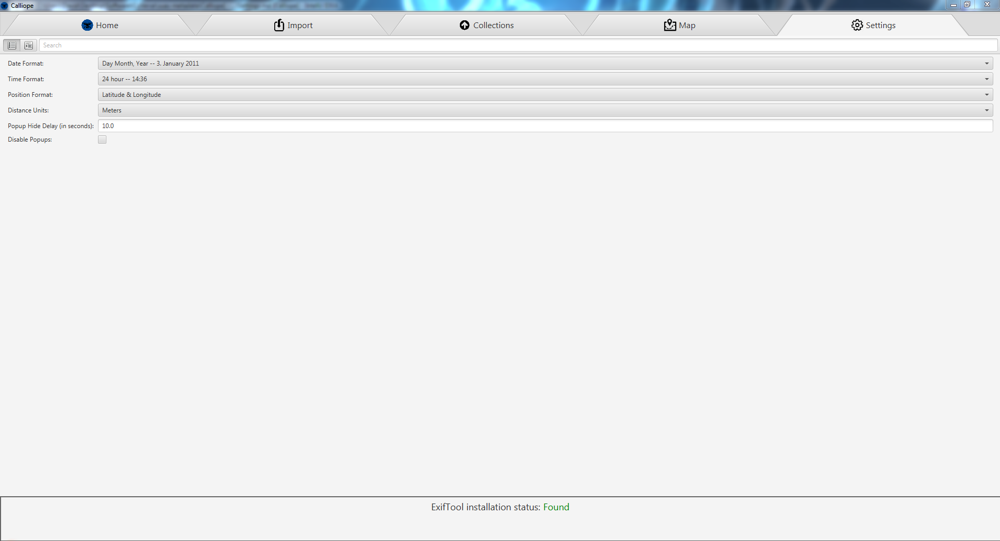

# Settings Tab

The settings tab lets you customize Calliope's look and feel. The customizable settings are:
- Date Format - What format dates should be displayed as in the program.
- Time Format - What format times are displayed as in the program.
- Position Format - Sets locations to display as latitude & longitude or UTM coordinates.
- Distance Units - If calliope should show distances in feet or meters.
- Hide Popup Delay - Only used if 'Disable Popups' is checked. Sets the wait time each popup will stay before being automatically closed.
- Disable Popups - If popups are a problem for your current system configuration (ex. using X11 forwarding) you can enable this to remove as many popups as possible and move them to the bottom of the screen, however some are unavoidable (such as importing images).

The settings tab will also show the current ExifTool status. In order to import images, ExifTool must be present on your system. ExifTool is a third-party program used to read image file's metadata ([Credit](https://www.sno.phy.queensu.ca/~phil/exiftool/)). If you open Calliope and that status is 'Found', you are good to go. If the status is 'Not Found', follow the instructions below the 'Not Found' to install ExifTool on your system.