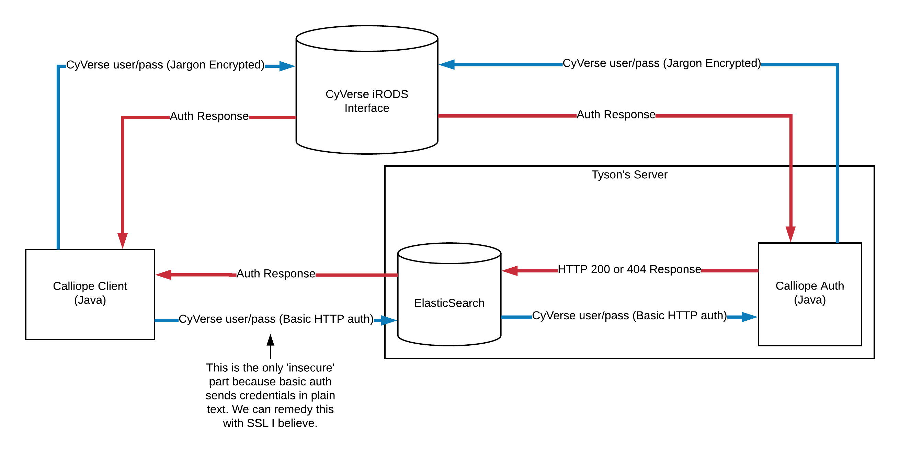

# Calliope Auth

Calliope Auth is a backend program developed to assist an ElasticSearch index in the process of authenticating users through CyVerse. 

## Installation

### Getting Started

This repository should be cloned and then built using maven. All Java dependencies will be automatically fetched through maven.

### Prerequisites

Java 8: <br>
http://www.oracle.com/technetwork/java/javase/downloads/jdk8-downloads-2133151.html<br> 
Maven:<br>
https://maven.apache.org/install.html

### Build from Source

Clone the github repository into a directory:

```shell
git clone https://github.com/cyverse-gis/suas-metadata <directory>
```
Build the project into an executable JAR file to run:

```shell
cd '<directory>/CalliopeAuth/'
mvn -U compile package
```

Run the program:

```shell
java -jar '<directory>/CalliopeAuth/target/CalliopeAuth-1.0-SNAPSHOT-jar-with-dependencies.jar'
```

## Usage and Documentation

ElasticSearch does not provide any methods of security or access control out of the box. This means anyone could execute the HTTP request `DELETE <elastic-ip>/metadata` and delete the entire metadata index permanently. In order to protect this index and the rest of the database, the ElasticSearch team have released a plugin called [X-Pack](https://www.elastic.co/products/stack). Unfortunately, many of the essential features are behind a monthly subscription. The free version simply does not have the features required by Calliope. 
 
 Luckily, ELasticSearch supports installing plugins that modify the database's behavior. One of these plugins is [ReadOnlyRest](https://github.com/sscarduzio/elasticsearch-readonlyrest-plugin). This plugin forces ElasticSearch to require a username and password as well as specific permissions before executing any HTTP REST requests. It has both a free and subscription based version, however unlike X-Pack the free version does everything Calliope needs. ReadOnlyRest lets administrators pick what usernames can access what indices, and more importantly configure how user authentication is done. In this case, we want to use CyVerse's official authentication API which makes use of OAuth2. ReadOnlyRest does not support OAuth2, which leads to a big issue... how does ElasticSearch authenticate users through CyVerse's APIs?

This is where Calliope Auth comes into play. ElasticSearch may be configured to send all authentication requests using basic HTTP authentication to an external web server. In our case, this is simply `localhost`. Since all communication is purely local, no encryption is required. Calliope Auth listens for these HTTP requests and then forwards them to CyVerse's authentication servers using iRODS. In order to support the iRODS protocol the [Jargon](https://github.com/DICE-UNC/jargon) library is used. After receiving a response from iRODS, Calliope Auth either responds with a `200` or `404` code which tells ElasticSearch if the authentication was successful or not. A diagram of this process is shown below:



Calliope Auth listens on a few different URL endpoints and will respond differently depending on the endpoint used. A list of current endpoints is below:

- Calliope User: By default all Calliope users are authenticated through the `localhost:port/calliopeUserLogin` endpoint which simply performs iRODS authentication and returns `200` if the account is valid or `404` if it is invalid. 
- Calliope Admin: The endpoint `localhost:port/calliopeAdminLogin` is used to test if a user has full permissions over the ElasticSearch index. It will only return code `200` if the given user is both a valid CyVerse user and also a valid Calliope administrator. The administrator list can be changed in the code.
- Calliope View: This special hard coded endpoint `localhost:port/calliopeViewUserLogin` only accepts the username `guest` and the password `guest`. It provides a highly restricted view of the data by only allowing specific read permissions. It is used in the [CalliopeView](https://github.com/Danielslee51/Calliope-View) project so that specific ElasticSearch indices may be read. 